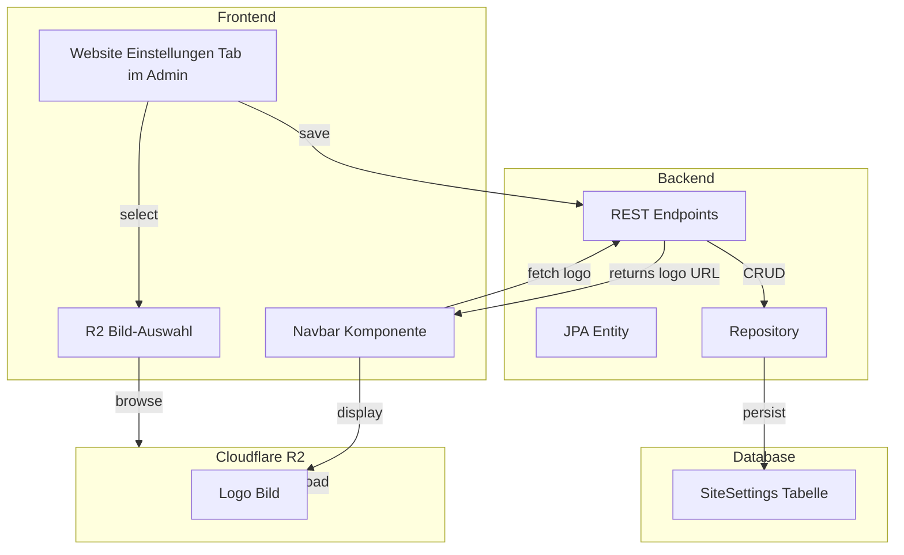

# Plan: Logo aus R2 auswählbar machen

## Zusammenfassung

Das Logo im Navbar (oben links) soll aus Cloudflare R2 auswählbar sein. Dazu wird eine neue "Website-Einstellungen"-Tabelle in der Datenbank erstellt, die zentral alle website-weiten Konfigurationen speichert.

---

## Architektur



---

## Implementierungsschritte

### 1. Datenbank-Migration erstellen

**Datei:** `src/main/resources/db/migration/V5__add_site_settings.sql`

```sql
CREATE TABLE site_settings (
    id BIGINT PRIMARY KEY,
    setting_key VARCHAR(100) NOT NULL UNIQUE,
    setting_value TEXT,
    updated_at TIMESTAMP NOT NULL DEFAULT CURRENT_TIMESTAMP
);

-- Standard-Logo setzen
INSERT INTO site_settings (id, setting_key, setting_value) VALUES (1, 'logo_url', '/assets/logo.png');
```

### 2. JPA Entity erstellen

**Datei:** `src/main/java/de/schwalmtalzupfer/config/SiteSettings.java`

```java
@Entity
@Table(name = "site_settings")
@Data
public class SiteSettings {
    @Id
    private Long id;

    @Column(name = "setting_key", nullable = false, unique = true)
    private String settingKey;

    @Column(name = "setting_value", columnDefinition = "TEXT")
    private String settingValue;

    @Column(name = "updated_at")
    private LocalDateTime updatedAt;
}
```

### 3. Repository erstellen

**Datei:** `src/main/java/de/schwalmtalzupfer/config/SiteSettingsRepository.java`

```java
public interface SiteSettingsRepository extends JpaRepository<SiteSettings, Long> {
    Optional<SiteSettings> findBySettingKey(String key);
}
```

### 4. REST Endpoints hinzufügen

**Datei:** `src/main/java/de/schwalmtalzupfer/admin/AdminController.java` (erweitern)

```java
@GetMapping("/settings")
public Map<String, Object> getSiteSettings() {
    // Returns all site settings as key-value map
}

@PutMapping("/settings")
public ResponseEntity<Void> updateSiteSettings(@RequestBody Map<String, String> settings) {
    // Updates multiple settings
}
```

### 5. Frontend Admin erweitern

**Datei:** `src/main/frontend/app/admin/page.tsx`

Neuer Tab "Website-Einstellungen" hinzufügen mit:
- Logo-URL-Feld mit R2-Bildauswahl (bestehende `ImageField` Komponente wiederverwenden)
- Vorschau des Logos

### 6. Navbar anpassen

**Datei:** `src/main/frontend/components/Navbar.tsx`

```typescript
// LogoURL von API laden
const [logoUrl, setLogoUrl] = useState('/assets/logo.png')

useEffect(() => {
  fetch(`${API_BASE}/api/admin/settings`)
    .then(r => r.json())
    .then(data => setLogoUrl(data.logo_url || '/assets/logo.png'))
    .catch(() => {})
}, [])

// Image src ändern
<Image src={logoUrl} alt="Logo" ... />
```

---

## Komponenten-Übersicht

| Komponente | Datei | Änderung |
|------------|-------|----------|
| Flyway Migration | `V5__add_site_settings.sql` | Neu |
| JPA Entity | `SiteSettings.java` | Neu |
| Repository | `SiteSettingsRepository.java` | Neu |
| AdminController | `AdminController.java` | Erweitern |
| Admin Page | `admin/page.tsx` | Tab hinzufügen |
| Navbar | `Navbar.tsx` | API-Integration |

---

## Bestehende Komponenten zur Wiederverwendung

- **ImageField**: Bietet Eingabefeld + "R2 wählen" Button (bereits in admin/page.tsx)
- **AssetPickerModal**: Modales Fenster zur R2-Bildaustastung (bereits in admin/page.tsx)
- **R2ProxyController**: Fungiert als Proxy für R2-URLs

---

## Testergebnis

Nach der Implementierung:
1. Admin-Benutzer können im Tab "Website-Einstellungen" das Logo aus R2 auswählen
2. Das ausgewählte Logo wird in der Datenbank gespeichert
3. Die Navbar liest die Logo-URL automatisch aus der API
4. Das Logo wird im Navbar angezeigt